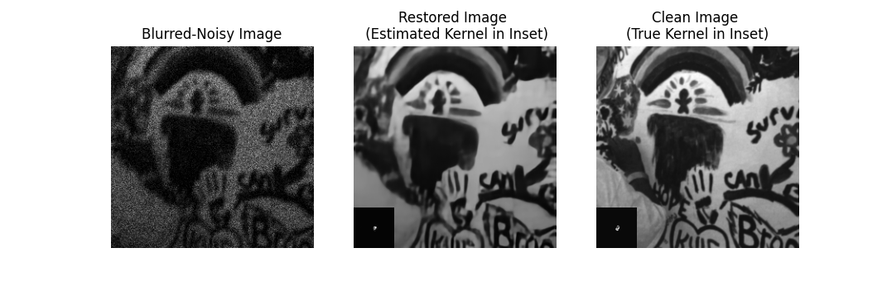
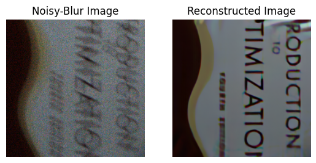

# Official Code for Structured Kernel Estimation for Photon-Limited Deconvolution  (CVPR 2023)
<p align="center">
 
</p>

## Instructions
1. Create a local copy of repository using the following commands
      ```console
      foor@bar:~$ git clone https://github.com/sanghviyashiitb/structured-kernel-cvpr23.git
      foor@bar:~$ cd structured-kernel-cvpr23
      foor@bar:~/structured-kernel-cvpr23$       
      ```
      
2. Download the pretrained models, i.e. denoiser, p4ip, and ktn  into ```model_zoo``` from the link [here](https://drive.google.com/drive/folders/1pzvzZ4Hzt8i6JvuAIaZDjGCjC3i0YX4p?usp=share_link)
      
3. To test the network on levin-data, run the file 
      ```console
      foor@bar:~/structured-kernel-cvpr23$ python3 demo_grayscale.py  
      ```
      <p align="center">
      
      </p>
4. To test the network on real-sensor data, run the file 
      ```console
      foor@bar:~/structured-kernel-cvpr23$ python3 demo_real.py  
      ```
      <p align="center">
      
      </p>
      
  For further details on this dataset containing real-sensor noise + motion blur along with ground-truth kernels i.e., _Photon Limited Deblurring Dataset (PLDD)_ refer to this [link](https://aaaakshat.github.io/pldd/)   
 ### Citation
 
 ```
@InProceedings{Sanghvi_2023_CVPR,
    author    = {Sanghvi, Yash and Mao, Zhiyuan and Chan, Stanley H.},
    title     = {Structured Kernel Estimation for Photon-Limited Deconvolution},
    booktitle = {Proceedings of the IEEE/CVF Conference on Computer Vision and Pattern Recognition (CVPR)},
    month     = {June},
    year      = {2023},
    pages     = {9863-9872}
}
 ```

Feel free to ask your questions/share your feedback using the [Issues](https://github.com/sanghviyashiitb/structured-kernel-cvpr23/issues) feature at the the top of this page. 
