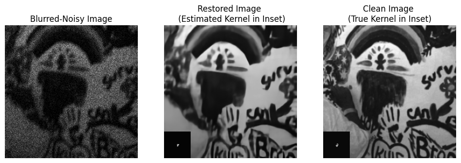

# Official Code for Structured Kernel Estimation for Photon-Limited Deconvolution  (CVPR 2023)

 


## Instructions
1. Create a local copy of repository using the following commands
      ```console
      foor@bar:~$ git clone https://github.com/sanghviyashiitb/structured-kernel-cvpr23.git
      foor@bar:~$ cd structured-kernel-cvpr23
      foor@bar:~/structured-kernel-cvpr23$       
      ```
      
2. Download the pretrained models, i.e. denoiser, p4ip, and ktn  into ```model_zoo``` from the link [here](https://drive.google.com/drive/folders/1pzvzZ4Hzt8i6JvuAIaZDjGCjC3i0YX4p?usp=share_link)
      
3. To test the network on levin-data, run the file 
      ```console
      foor@bar:~/structured-kernel-cvpr23$ python3 demo_grayscale.py  
      ```
      
4. To test the network on real-sensor data, run the file 
      ```console
      foor@bar:~/structured-kernel-cvpr23$ python3 demo_real.py  
      ```
      
      
 ### Citation
 
 ```
@article{sanghvi2023structured,
  title={Structured Kernel Estimation for Photon-Limited Deconvolution},
  author={Sanghvi, Yash and Mao, Zhiyuan and Chan, Stanley H},
  journal={arXiv preprint arXiv:2303.03472},
  year={2023}
}
 ```

Feel free to ask your questions/share your feedback using the "Issues" feature at the the top of this page. 
